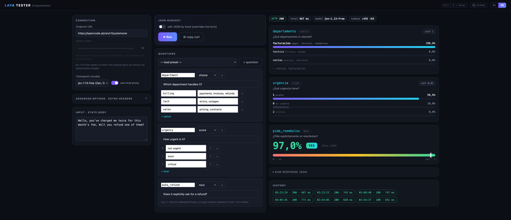

# Laya Tester

**Español** | [English](README.en.md)

[](LICENSE)



Una página para probar un servidor [Laya](https://github.com/NandhaKishorM/laya) (`laya-serve`) o cualquier API compatible con el protocolo de Jev (`POST /v1/systemone`), sin tener que andar escribiendo curls a mano.

Montas las preguntas (elegir opción, puntuar del 1 al N, o sí/no), le das a ejecutar y ves la respuesta con sus porcentajes bien pintados: barras por opción, la aguja en la escala de urgencia, el medidor de sí/no, la confianza de cada respuesta, lo que ha tardado…

No hay nada que instalar. Ni Node, ni npm, ni dependencias.

## Cómo se usa

```bash
python3 server.py
```

Y abres <http://127.0.0.1:8899> en el navegador. Ahí pones la URL de tu endpoint y el Bearer token, escribes el texto a evaluar, defines tus preguntas y le das a **Ejecutar** (o `Ctrl/⌘ + Enter`).

## Con Docker

Si prefieres no tocar el Python del sistema:

```bash
docker build -t laya-tester .
docker run --rm -p 8899:8899 laya-tester
```

O directamente con Compose:

```bash
docker compose up --build
```

La imagen es `python:3.12-alpine`, sirve en `0.0.0.0:8899` dentro del contenedor y expone el 8899 al host. Puedes cambiar el puerto con `-e PORT=...` y `-p`.

## Probar Jev gratis (OpenCode Zen)

Además de tu servidor Laya, el tester apunta directo a Jev sin coste y sin key:

1. En **Conexión**, elige `jev-1.13-free (Zen, free)` en *Checkpoint (model)*. Si la URL está vacía se rellena sola con `https://opencode.ai/zen/v1/systemone`.
2. El campo de Bearer se desactiva: esa API es anónima y la petición sale sin cabecera `Authorization`.
3. Ejecuta. Contesta igual que Laya — `choice`, `score` y `noul` con sus probabilidades, `usage` y todo.

Para tu propio servidor (`laya-serve`) no cambia nada: tu URL + tu Bearer + un checkpoint de Laya (`auto`, `english`, `multilingual` o `typed-decisions`). Y si la API necesita cabeceras propias (`X-Title`, `HTTP-Referer`…), están en la tarjeta **Cabeceras extra** y salen también en el `curl`.

## Qué hace falta

- **Python 3.8 o superior**, solo eso. El servidor usa únicamente la librería estándar (`http.server`, `urllib`), así que el `python3` que ya tienes en el Mac o en Linux vale tal cual.
- La página en sí es HTML, CSS y JavaScript puros, sin frameworks ni builds. Cualquier navegador moderno la renderiza.

## Por qué hay un servidor (y no solo un HTML)

`laya-serve` no manda cabeceras CORS, así que si abres la página a pelo y el navegador intenta llamar a la API desde otro origen, te lo bloquea antes de salir. `server.py` resuelve esto de la forma simple: sirve la página y tiene un endpoint `POST /proxy` que reenvía la petición por ti. Como la llamada sale del servidor y no del navegador, CORS deja de importar.

Todo corre en `127.0.0.1:8899`, no se abre nada a la red. Y si algún día tu API añade CORS, puedes desmarcar «usar proxy local» y que el navegador llame directo.

## Lo que puedes hacer en la página

- **Conexión**: URL, Bearer token y checkpoint (`auto`, `english`, `multilingual`, `typed-decisions` o `jev-1.13-free` de OpenCode Zen, gratis y sin key).
- **Cabeceras extra**: añade cualquier cabecera HTTP a la petición (`X-Title`, `HTTP-Referer`…); se envían por el proxy, en modo directo y salen incluidas en el `curl`.
- **Preguntas**: las construyes con formularios, una a una. Los tres tipos que entiende el modelo:
  - `choice` — eliges entre opciones con su descripción (¿qué departamento lo atiende?)
  - `score` — puntúa en una escala ordenada que tú defines (no urgente → crítico)
  - `noul` — devuelve la probabilidad de un sí/no (¿pide reembolso?)
- **Presets**: cuatro ejemplos ya montados (soporte, triaje completo, guardrail, router de modelos) para empezar rápido.
- **Modo JSON**: si prefieres, editas el payload completo a mano y el formulario se ignora.
- **Resultados**: barras de probabilidad animadas con la opción ganadora destacada, la escala con aguja y la distribución por nivel, el medidor de sí/no con color, badges de `confidence` y `answer_confidence`, código HTTP, latencia total y de inferencia, modelo usado con el motivo del routing y tokens consumidos.
- **Extras**: copiar la petición como `curl` lista para el terminal, e historial con las últimas 10 ejecuciones (clic en cualquiera para volver a verla).

## La petición por debajo

Al final lo que envía es esto (lo mismo que harías con curl):

```json
{
  "state": {"body": "Hola, me habéis cobrado dos veces la cuota de este mes. ¿Me devolvéis una?"},
  "questions": {
    "departamento": {
      "type": "choice",
      "instructions": "¿Qué departamento lo atiende?",
      "criteria": {"facturacion": "pagos, facturas, reembolsos", "tecnico": "errores, caídas"}
    },
    "urgencia": {
      "type": "score",
      "instructions": "¿Qué urgencia tiene?",
      "criteria": ["no urgente", "pronto", "crítico"]
    },
    "pide_reembolso": {
      "type": "noul",
      "instructions": "¿Pide explícitamente un reembolso?"
    }
  }
}
```

Con `Authorization: Bearer <tu-token>` en la cabecera. Si eliges un checkpoint concreto se añade `"model"` al body; en `auto` no se envía y decide el router.

## Sobre el token

Se guarda en el `localStorage` del navegador para no tener que pegarlo cada vez que recargas, y no viaja a ningún sitio más allá de la URL que tú configures (a través del proxy local). Si te molesta que se quede guardado, borra el campo antes de recargar.

## Archivos

Todo el código son dos ficheros, para que no haya sorpresas:

- `index.html` — la página entera: interfaz, estilos y lógica, todo en un fichero.
- `server.py` — el servidor estático y el proxy, en Python estándar.
- `Dockerfile` + `docker-compose.yml` — para levantar todo en un contenedor.

Y luego solo recursos: `favicon.svg` + sus PNGs, `docs/captura.png` y los ficheros de GitHub (`.github/`, `LICENSE`, `CHANGELOG.md`…).

## Licencia

MIT. Mira el fichero [LICENSE](LICENSE). Esto es un cliente de pruebas: el modelo y su servidor pertenecen a su autor, aquí no se incluye nada de eso.
